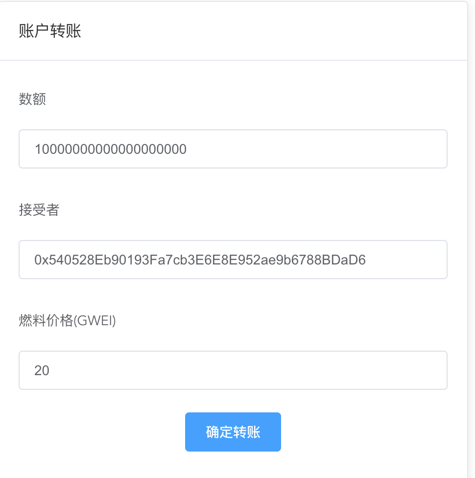

<!-- TOC -->

- [发布到小狐狸的ganache的rpc中。](#发布到小狐狸的ganache的rpc中)
  - [运行代码](#运行代码)
    - [下载代码：](#下载代码)
    - [安装代码依赖包：](#安装代码依赖包)
    - [安装完成后，](#安装完成后)
    - [打开小狐狸钱包。](#打开小狐狸钱包)
    - [访问客户端，](#访问客户端)
  - [编译合约](#编译合约)
    - [编译合约 truffle  complie](#编译合约-truffle--complie)
    - [发布合约 truffle migrate](#发布合约-truffle-migrate)
    - [调试合约 truffle console](#调试合约-truffle-console)
  - [部署成功后，查看帐号代币数量。](#部署成功后查看帐号代币数量)
    - [小狐狸添加合约代币。](#小狐狸添加合约代币)
      - [打开小狐狸，点击“添加代币”](#打开小狐狸点击添加代币)
      - [添加部署合约的“合约地址”](#添加部署合约的合约地址)
      - [查看数额](#查看数额)
    - [客户端查查帐号余额。](#客户端查查帐号余额)
  - [实现发送代币。](#实现发送代币)
- [发布到ropsten测试网。](#发布到ropsten测试网)
  - [修改小狐狸的网络为“Ropsten测试网络”](#修改小狐狸的网络为ropsten测试网络)
  - [修改truffle-config.js的networks。](#修改truffle-configjs的networks)
  - [修改truffle-config.js的mocha。](#修改truffle-configjs的mocha)
  - [根目录创建 ```.secret```  文件， 并添加帐号的私钥。私钥可以从metamask的帐后详情导出。](#根目录创建-secret--文件-并添加帐号的私钥私钥可以从metamask的帐后详情导出)
  - [编译合约 truffle complie](#编译合约-truffle-complie)
  - [发布合约  truffle migrate --network=ropsten](#发布合约--truffle-migrate---networkropsten)
  - [发布合约  truffle console  --network=ropsten](#发布合约--truffle-console----networkropsten)
  - [。。。。。。](#)

<!-- /TOC -->
# 发布到小狐狸的ganache的rpc中。

## 运行代码

###  下载代码：

  >  http s://github.com/hongtoushizi/qukuailian/blob/master/demo-wallet.zip

###  安装代码依赖包：
```
yarn install
```


###  安装完成后，

	yarn serve
  > ## 结果错误
  >
  > 启动的时候会报： `Syntax Error: Error: No ESLint configuration found in /Users/yuan/nodejs_subject/demo-wallet2/src.`
  >
  > 解决方案：
  >
  > - 可以安装ESLint插件进行全部格式化。
  > - 将package.json中的eslint相关包都删除掉。（比较暴力）
  >
  > 启动成功后，会提示访问地址：
  >
  > ```
  > App running at:
  >   - Local:   http://localhost:8080/ 
  >   - Network: http://192.168.34.50:8080/
  > 
  >   Note that the development build is not optimized.
  >   To create a production build, run yarn build.
  > ```

###  打开小狐狸钱包。

>  选择 loccal  7545 RPC 代理:

  >  

### 访问客户端，

> 地址： http://localhost:8080/

  >  打开客户端后，当看到账户信息里面有钱包地址了，就说明web3客户端和小狐狸链接成功了。
  >
  > 

## 编译合约

### 编译合约 truffle  complie

###  发布合约 truffle migrate

###  调试合约 truffle console

  > 获取合约地址：
  >
  > ```
  > truffle(development)> MoneyToken.address
  > 
  > '0xd6DD060Cc2b976C6218F274BBDe637E85Af6c0dA'
  > ```
  >
  > 
  >
  > 获取合约实例：
  >
  > >  let instance = await web3.eth.getAccounts()
  >
  > 获取帐号：
  >
  > ```
  > truffle(development)> let accounts = await web3.eth.getAccounts() //获得账户
  > undefined
  > truffle(development)> accounts
  > [
  >   '0x05ec4CdDe365123006950CE25F4CB4CA82D0c22a',
  >   '0x540528Eb90193Fa7cb3E6E8E952ae9b6788BDaD6',
  >   '0xbBDb5438d70391224d32b342d178c007cF74475c',
  >   '0x8E29A5C79ee6E7a311D6267c2a1E2C4adFda0b1d',
  >   '0x23E7eD1aE31e496724AB1efc998A07ED3AA9D5Df',
  >   '0x257e624A11f2EC8A660807d3652A7eBc94D0FeCc',
  >   '0xA343f6720D2B4eeb55E5Ca9E89Ec7506DbDd4827',
  >   '0x973cC22284A6D1ff1E54A80E4331570569bd47eF',
  >   '0x9b37E38744621E07Bf22E63D4719A3E6a60974a5',
  >   '0x4c0A2111D142D24e3f503bdF6Fc933cfD118c726'
  > ]
  > truffle(development)> 
  > ```
  >
  > 获取总发行量
  >
  > ```
  > truffle(development)> instance.totalSupply()
  > BN {
  >   negative: 0,
  >   words: [ 0, 33764537, 58535372, 330, <1 empty item> ],
  >   length: 4,
  >   red: null
  > }
  > 
  > ```
  >
  > > 
  >
  > 获取帐号余额。
  >
  > ```
  > truffle(development)> instance.balanceOf(accounts[0])
  > BN {
  >   negative: 0,
  >   words: [ 0, 33764537, 58535372, 330, <1 empty item> ],
  >   length: 4,
  >   red: null
  > }
  > 
  > ```
  >
  >   备注：
  >
  > > 此处大家可能会发现"总发送量"和“第一个帐号的总量”是一样。为什么呢？我们观察ERC20源码可以得到答案
  > >
  > > - ERC30在给合约地址陪额的时候，是直接给第一个帐号进行配额的。(approve方法：审批， 设置合约地址的allowance配额数量 )
  > >
  > > 
  > >
  > > - ERC30在进行转账操作的时候，也是通过第一个帐号进行转账的。
  > >   
  > >
  > >   -总结： 部署合约的时候，第一个帐号就充当了，这个合约上“资产拥有者”的这个角色。

## 部署成功后，查看帐号代币数量。

 > 备注： 此处我门查看第一个帐号的MoneyToken的数量。


###      小狐狸添加合约代币。
####      打开小狐狸，点击“添加代币”


####  添加部署合约的“合约地址”

>  此处是： 0xd6DD060Cc2b976C6218F274BBDe637E85Af6c0dA。


####      查看数额

 点击“下一步”，我门就可以看到，第一帐号拥有的代币数额了。最终资产展现图如下：


### 客户端查查帐号余额。

刷新页面我们页面中已有账户余额了。


## 实现发送代币。

-  在src/views/Home.vue中添加转账代码

  ```js
   contract.methods.transfer(to, value).send({from: from}, function (error, transactionHash) {
            console.log("---from----" + from)
            console.log("transactionHash")
            console.log(transactionHash)
            console.log("transactionHash")
          });
  ```

  

-  运行代码转账。

  

  

- 点击“确定转账”

  点击后弹出一下页面，即证明转账功能实现。

  

-  完成验证。

  > 完成以上步骤后，在接受资产的帐号中，添加代币合约地址后，既可查看到转的MTK资产。

- 到此即完成ganache的测试地址发布ERC20币，及转账的功能。

  

#  发布到ropsten测试网。

## 修改小狐狸的网络为“Ropsten测试网络”

## 修改truffle-config.js的networks。

  > 打开以下“屏蔽代码”：
  >
  > ```
  >  const HDWalletProvider = require('@truffle/hdwallet-provider');
  >  const fs = require('fs');
  >  const mnemonic = fs.readFileSync(".secret").toString().trim();
  > ```
  >
  > 打开以下屏蔽代码：
  >
  > ```
  >     ropsten: {
  >       provider: () => new HDWalletProvider(mnemonic, `https://ropsten.infura.io/v3/9aa3d95b3bc440fa88ea12eaa4456161`),
  >       network_id: 3, // Ropsten's id
  >       gas: 5500000, // Ropsten has a lower block limit than mainnet
  >       confirmations: 2, // # of confs to wait between deployments. (default: 0)
  >       timeoutBlocks: 200, // # of blocks before a deployment times out  (minimum/default: 50)
  >       skipDryRun: true // Skip dry run before migrations? (default: false for public nets )
  >     },
  >     
  > ```

## 修改truffle-config.js的mocha。

  ```
  // Set default mocha options here, use special reporters etc.
      mocha: {
          // timeout: 100000
          enableTimeouts: false,
          before_timeout: 120000
      },
  ```

  >  到此需要发布到ropsten的准备工作已完成

## 根目录创建 ```.secret```  文件， 并添加帐号的私钥。私钥可以从metamask的帐后详情导出。

## 编译合约 truffle complie

## 发布合约  truffle migrate --network=ropsten

  > 此处会比较慢，确保梯子没问题情况下，耐心等待吧。

## 发布合约  truffle console  --network=ropsten

  

## 。。。。。。

> 以后的操作和“发币到小狐狸ganache的rpc测试网络”操作一样。此处不再描述。

